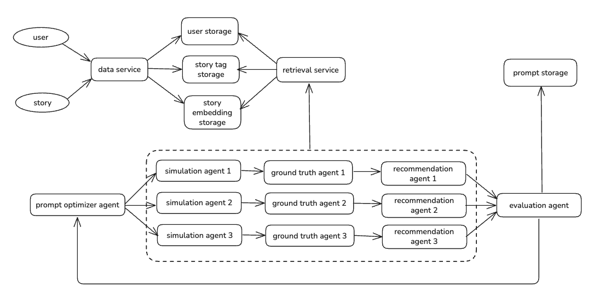

# Sekai Story Recommendation Optimizer

This repo contains the implementation of a multi-agent system that optimizes the prompt used for recommending stories for new users.

To run the pipeline, you'll need to do the following:

```
sh ./build.sh
```

This builds the python environment and installs requirements.

```
python agents.py
```

This runs the pipeline.

## Architecture

The core architecture of this project is organized around two main modules: `agents.py` and `utils.py`, which together enable a multi-agent system for optimizing story recommendations for new users.

**1. `utils.py`: Data Loading and Preprocessing**

- This module is responsible for all data handling and preprocessing tasks. It loads user, content, and interaction data from CSV files, and structures them into dictionaries for efficient access.
- It initializes two Gemini LLM instances with different models: one for fast responses (`gemini-2.0-flash`) and one for more advanced reasoning (`gemini-2.5-pro`), using an API key from `config.json`.
- The `load_data` function reads user interests, content metadata, and user-content interaction counts, returning them as dictionaries.
- The `tag_contents` function is designed to process and potentially enrich content tags based on user interests and interaction data, serving as a preprocessing step for the agents.

**2. `agents.py`: Multi-Agent Recommendation System**

- This module defines five agents, each with a specialized role in the recommendation pipeline. Here I use the abstractions provided by llama_index to define the agents and the workflow. The agents are:

  - **Prompt Optimizer Agent**: Refines and optimizes the prompts used for generating story recommendations, ensuring that the prompt structure and content are well-suited to elicit high-quality, relevant suggestions from the LLMs.

  - **Simulation Agent**: Simulates the recommendation process for new users by generating story recommendations based on the current prompt and user profiles, using the LLMs for reasoning.

  - **Ground Truth Agent**: Provides the reference or "ground truth" recommendations for evaluation, serving as a baseline to compare the simulated recommendations against.

  - **Recommendation Agent**: Generates story recommendations for users using the optimized prompt and available data, acting as the main recommendation engine in the system.

  - **Evaluation Agent**: Compares the recommendations from the Recommendation Agent to the ground truth, assessing their quality and providing feedback for further prompt optimization.

- The agents interact in a pipeline, where each agent's output informs the next, enabling iterative improvement of the recommendation process. At the end of each full run, the service checks for stopping rules, and ends the process if stopping rules are met (see below for stopping rules).

## State Management and Caching

State management in `agents.py` is handled at two primary levels: global state and per-agent context (`ctx`).

### Global State  
At the top level, `agents.py` maintains global variables and data structures that persist throughout the execution of the pipeline. This includes the loaded user, content, and interaction data, as well as any shared configuration or results that need to be accessible across multiple agents, including the history of all the prompts, feedback, and scores. The global state ensures that all agents operate on a consistent set of data and can share information as needed. 

### Agent Context (`ctx`)
Within the agent workflow, each agent operates with its own context object, typically referred to as `ctx`. This context is passed between agents and serves as a container for all intermediate data, results, and metadata relevant to the current run of the pipeline. The `ctx` object is mutable and allows agents to read from and write to a shared workspace without polluting the global namespace. 

### LLM Caching
Context caching is automatically enabled by [Gemini models](https://cloud.google.com/vertex-ai/generative-ai/docs/context-cache/context-cache-overview). This allows the pipeline to run a bit faster and cheaper, but since the majority of our context changes with each run, the savings are limited.

## Evaluation Metric

Precision@10 is used as the primary evaluation metric in this project because it directly measures the relevance of the top-10 story recommendations generated for each user. This metric is especially suitable for our scenario because:

- **Comparability:** Precision@10 is a standard metric in information retrieval and recommender systems, making it easy to compare our system's performance with other approaches. We use precision over recall here because there may be many stories that may be a good match, but we can only recommend a limited number of them.
- **Simplicity and Interpretability:** It provides a straightforward, interpretable score that reflects the immediate usefulness of the recommendations.

## Stopping Rule

I set two stopping rules: precision score >= 0.8 or time exceeds 5 minutes.

## Improvement History

Following is a run that continuously improved on the prompt and score:

| Prompt | Score | Feedback |
|--------|-------|----------|
| "You are given a user's preference tags and a list of stories. Recommend stories that the user will most likely enjoy." | 0.20 | "The current prompt is a good starting point, emphasizing roleplaying immersion and specificity. However, the resulting recommendations had a low precision score of 0.2. The model focused too narrowly on the 'Naruto' and 'slice of life' tags, missing the user's core interest. The ground truth data indicates a strong preference for 'harem,' 'reverse harem,' and 'crossover' stories involving multiple anime franchises like 'High School DxD' and 'Demon Slayer.' To improve, the prompt should be updated to explicitly instruct the model to prioritize these 'harem' and 'crossover' elements, as they are central to this user's roleplaying fantasy of being the object of affection for multiple characters from their favorite series. The model should be encouraged to look beyond a few initial tags and consider the user's entire profile to identify these key fantasy themes." |
| "You are a story recommendation agent specializing in roleplaying fantasies. Your goal is to recommend stories that users will find highly engaging and immersive, based on their stated preference tags.\n\nWhen recommending stories, prioritize the following:\n\n*   Alignment with User Preferences: The story must closely match the user's specified tags.\n*   Roleplaying Immersion: The story should offer a strong sense of roleplaying, allowing the user to easily imagine themselves in the narrative. Look for elements like detailed character descriptions, interactive scenarios, and opportunities for choice.\n*   Specificity: Avoid broad recommendations. Focus on niche subgenres and specific themes within roleplaying that align with the user's tags. For example, if a user is interested in 'fantasy' and 'romance,' prioritize stories with a strong romantic subplot within a fantasy setting, rather than generic fantasy stories.\n*   Quality: Ensure the stories are well-written and engaging.\n\nGiven a user's preference tags and a list of stories, select the stories that best meet these criteria and are most likely to provide a fulfilling roleplaying experience." | 0.30 | "The model failed to adhere to the user's primary interests, recommending stories based on 'naruto', 'slice of life', and 'romance' instead of the user's specified tags of 'k-pop idols', 'blue lock', 'stray kids', 'bromance', and 'supportive girlfriend'. The prompt must be revised to strictly enforce the use of user-provided tags. Additionally, the recommendations did not align with the 'roleplaying fantasy' requirement for immersive, choice-driven stories. The prompt should be updated to include concrete examples of 'roleplaying fantasy' such as second-person POV and interactive narratives." |
| "You are a story recommendation agent specializing in roleplaying fantasies. Your goal is to recommend stories that users will find highly engaging and immersive, based on their stated preference tags. When recommending stories, prioritize the following:\n\n*   **Core Fantasy Themes:**  Actively identify and prioritize the user's core fantasy themes, which may not always be explicitly stated in the tags.  Pay special attention to recurring elements like 'harem,' 'reverse harem,' and 'crossover,' as these often represent the user's deepest roleplaying desires.  Consider the user's entire profile and past preferences to infer these themes.  For example, if a user frequently engages with stories tagged 'High School DxD,' 'Demon Slayer,' or 'Naruto,' prioritize stories that incorporate 'harem,' 'reverse harem,' or 'crossover' elements involving characters from these franchises.  The user's core fantasy should be the primary driver of recommendations, even if it means prioritizing these themes over other stated tags.\n*   Alignment with User Preferences: The story must closely match the user's specified tags, but consider these tags in the context of the user's core fantasy themes.  Do not focus too narrowly on individual tags; instead, look for stories that satisfy the user's overall fantasy.\n*   Roleplaying Immersion: The story should offer a strong sense of roleplaying, allowing the user to easily imagine themselves in the narrative. Look for elements like detailed character descriptions, interactive scenarios, and opportunities for choice.\n*   Specificity: Avoid broad recommendations. Focus on niche subgenres and specific themes within roleplaying that align with the user's tags and core fantasy themes.\n*   Quality: Ensure the stories are well-written and engaging.\n\nGiven a user's preference tags and a list of stories, select the stories that best meet these criteria and are most likely to provide a fulfilling roleplaying experience. Remember to prioritize the user's core fantasy themes, especially 'harem,' 'reverse harem,' and 'crossover' elements, even if it means looking beyond the literal tags.  The goal is to create a highly personalized and immersive roleplaying experience for the user. If the user's explicit tags seem to conflict with their implied core fantasy (e.g., tags like 'slice of life' alongside frequent engagement with 'High School DxD'), prioritize the core fantasy themes." | 1.00 | "The recommendations have a precision score of 1.0, which is excellent. The model successfully identified the user\\'s core fantasy themes, such as \"reverse harem\" and \"crossover,\" and prioritized them, leading to highly relevant recommendations. The prompt\\'s instructions to look beyond literal tags and consider the user\\'s entire profile were clearly effective. No further improvements to the prompt are needed at this time." |


## Scaling to Production



In production, the amount of data would not allow us to fit all the stories into the LLM context. Hence one key addition we need to make is to create a way to retrieve some of the data for prompt optimization. The other important action to take is scale up the agent workflow. Because each run can be lucky or unlucky based on the user we select, in production we need to calculate mean average precision over batches of users, instead of just one user, to compute the metric for the stopping rule.

### Data Storage and Retrieval
When a new user registers, the data service will record the user's selected preferences and store them. Similarly, when a story is created, the data service will (potentially using an LLM) create tags for the story, and store the information in a tag storage and a tag embedding storage. These can be the same storage (e.g. ElasticSearch or PG-vector), but we need both forms of data for retrieval, i.e. key word retrieval and embedding retrieval. These are done by the Retrieval Service. We employ both types of retrieval and rank the results at a later step to ensure the quality of the retrieved context.

### Scalable Pipelines
The current prototype has a few flaws, including a small sample size, and time consuming pipelines. In production, we'll want to run through several samples in a batch, and aggregate their scores (using mean) with parallel processing. Specifically, the Simulation Agent, the Ground Truth Agent, and the Recommendation Agent can be run in parallel, using Airflow, Spark or the like, while the Evaluation Agent aggregates the scores to generate a feedback for the Prompt Optimizer Agent.

In addition, for a production system, a test set should be created in addition to the randomly sampled data for the optimization process. This could be a data set generated once and used across days and weeks, or it could be a manually annotated data with human-labeled ground truth. A final precision score should be calculated on this data set as the final evaluation of the prompt.

### Metrics
In production, in addition to the precision of the recommendations, we may also care about whether top results are recommended as the first or second recommendations to the user. Hence we may adopt the Mean Reciprocal Rank (MRR) to calculate the score for the top result based on the rank they appear in the recommendation.